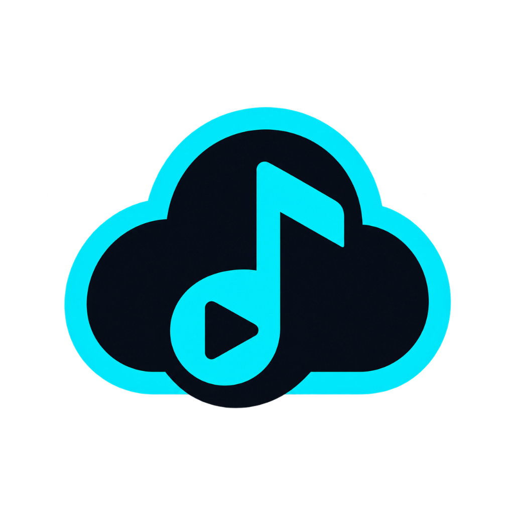

# DriveTune

> Your music. Your Drive. Offline.

<p align="center">
  
</p>

DriveTune is an offline-first Android music player that connects to Google Drive, lets users browse and download their music, upload music from their phone to selected Google Drive folders, and play their local music offline.

---

## Features

- **Google Sign-In**: Secure account authentication with Google.
- **Google Drive Music Browsing**: Seamlessly browse your personal Google Drive audio library.
- **My Drive Folder Traversal**: Deep folder navigation to find music wherever it is organized in Drive.
- **Audio-Only Filtering**: Automatically queries and displays audio files (MP3, FLAC, WAV, M4A, OGG).
- **Offline Music Downloads**: Select and download music for offline playback directly to private on-device storage.
- **Phone-to-Drive Audio Uploads**: Select one or multiple audio files from your phone and upload them to Google Drive.
- **Drive Folder Selection & Creation**: Choose any destination folder in Google Drive or create a new folder on the fly.
- **Dual-Copy Storage**: Keep uploaded music immediately available in your local library for offline listening while backing it up to Google Drive.
- **Local App-Private Storage**: Downloaded music is stored securely in app-private storage without requiring broad device storage permissions.
- **Album & Folder Organization**: Automatically organizes tracks into albums based on Drive folder structures.
- **Playlists**: Create, rename, manage, and play custom offline playlists.
- **Local Audio Playback Engine**: Smooth native audio playback powered by MediaPlayer with support for background playback.
- **Now Playing Screen**: Full-screen player with seek bar, playback controls, album art, and contextual track options.
- **Mini Player**: Persistent bottom bar player for quick playback control across the entire app.
- **Contextual Three-Dot Menus**: Quick actions for tracks, albums, and playlists (Play, Add to Playlist, Track Info, Remove from Library).
- **Duplicate Detection**: Prevents redundant downloads and avoids duplicate library entries.
- **Progress Tracking**: Real-time progress percentage indicators for active uploads and downloads.
- **Offline-First Architecture**: Enjoy full playback of your downloaded library anytime, anywhere, with zero internet connectivity required.

---

## How It Works

```text
Phone Audio
    ↓
 DriveTune
 ↙       ↘
Google Drive      Local App Storage
 (Cloud Backup)    (Offline Playback)
```

1. **Cloud to Device**: Browse your personal music stored in Google Drive and save selected songs to DriveTune's local storage.
2. **Device to Cloud**: Pick audio files from your phone via the native file picker, select or create a destination folder in Google Drive, and upload.
3. **Always Playable**: Uploaded tracks are immediately added to your local library so they are ready for offline playback without needing to re-download.
4. **Original Files Untouched**: Your original phone files remain safely in place and are never modified or deleted.

---

## Requirements

- Android device running **Android 8.0 (API Level 26)** or newer.
- A personal Google Account with Google Drive access.
- Internet connection for initial Google Sign-In, browsing Drive, downloading, and uploading.
- No internet connection required for playing downloaded local music.

---

## Installation

1. Download the latest `DriveTune-v1.0.0.apk` from the [GitHub Releases](https://github.com/strngx/DriveTune-Android/releases) section.
2. Open the downloaded APK file on your Android device to install.
   *(Note: Android may prompt you to allow installation from your browser or file manager).*
3. Launch **DriveTune**.
4. Tap **Continue with Google** and select your Google account.
5. Grant the requested Google Drive permissions (`drive.readonly` and `drive.file`).
6. Browse your Drive, download your songs, or add phone music, and start listening!

---

## Download

### Latest Release

The latest verified production APK is available under the Releases section:

🔗 **[DriveTune Releases](https://github.com/strngx/DriveTune-Android/releases)**

---

## Privacy

- **Minimal Permissions**: DriveTune only requests read-only Drive access (`drive.readonly`) to browse/download music and per-file access (`drive.file`) to upload music to folders you select.
- **No Broad Storage Permission**: DriveTune stores downloaded music in its own private app directory, eliminating the need for broad device storage access permissions.
- **Direct & Private**: Communication occurs directly between your device and Google's official APIs over secure HTTPS/TLS.
- **No Third-Party Telemetry**: DriveTune does not use analytics SDKs, advertising networks, or third-party servers.
- **Account Control**: You can sign out at any time from Settings to clear your cached session and credentials.

---

## Security

- **Signing Security**: The production release keystore is strictly kept offline and is **never** committed to the repository.
- **Local Configurations**: Machine-specific files such as `local.properties` and private credentials are excluded via `.gitignore`.
- **Encrypted Session**: Saved user session tokens are stored on-device using Android's `EncryptedSharedPreferences` backed by AES-256 GCM.
- **No Secrets in Source**: No OAuth tokens, passwords, or client secrets are committed in version control.

---

## Project Structure

```text
DriveTune-Android/
├── android/
│   ├── app/
│   │   ├── src/main/java/com/drivetune/app/
│   │   │   ├── auth/           # Google Sign-In & encrypted session management
│   │   │   ├── data/           # Repository layer & local persistent music store
│   │   │   ├── drive/          # Google Drive REST API v3 service & query builder
│   │   │   ├── model/          # Data models for Tracks, Albums, Playlists, Quota
│   │   │   ├── player/         # Native MediaPlayer playback controller
│   │   │   ├── theme/          # Material 3 dark color palette, typography & shapes
│   │   │   ├── ui/
│   │   │   │   ├── components/ # Reusable UI components, dialogs, cards, player bar
│   │   │   │   └── screens/    # Library, Drive browser, Now Playing, Playlists, Settings
│   │   │   └── viewmodel/      # MainViewModel and UI state management
│   │   └── src/main/res/       # App icons, official logo, and vector drawables
│   └── build.gradle.kts        # Root and application build configurations
└── README.md
```

---

## Development

DriveTune is a native Android application developed using:
- **Language**: Kotlin
- **UI Framework**: Jetpack Compose with Material 3
- **Architecture**: MVVM with Kotlin Coroutines & StateFlow
- **Media**: Native Android MediaPlayer
- **Cloud & Auth**: Google Play Services Auth & Google Drive API Client v3
- **Image Loading**: Coil Compose
- **Security**: AndroidX Security Crypto (EncryptedSharedPreferences)

---

## License

DriveTune is licensed under the MIT License.

See the [LICENSE](LICENSE) file for the complete license text.
